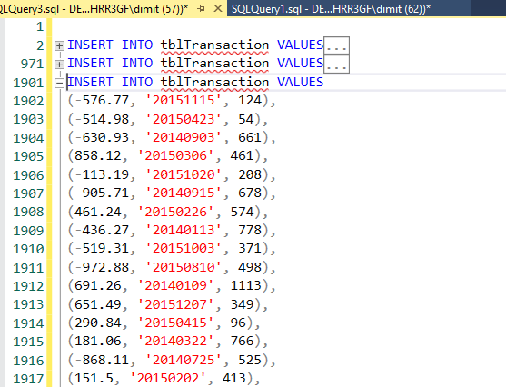

# Querying-Microsoft-Sql-Server 2019

## Project Overview
In this project I am using SSMS to manage and query  
Microsoft Sql Server 2019.

### Session 1
In first session I created three tables and inserted values into them.**[see query](https://github.com/DimKaisaris/Querying-Microsoft-Sql-Server/blob/main/queries/SQLQuery1.sql)**  
Functions and methods used:  Create, Alter, Drop, Alter column, Insert Into, Rollback tran, build in method for insert values for first table and query for second  

