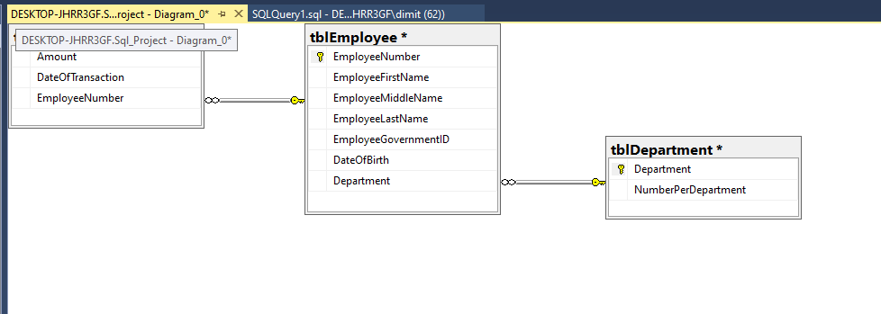
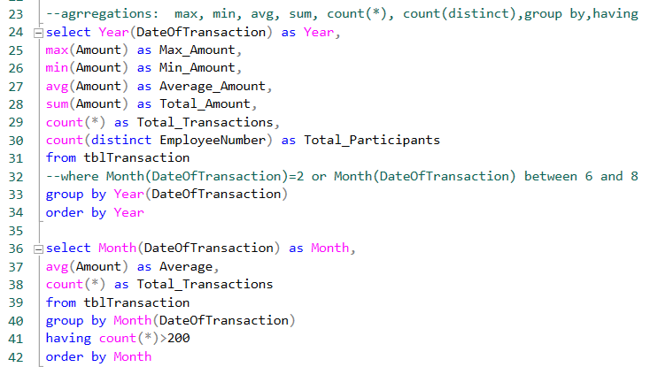
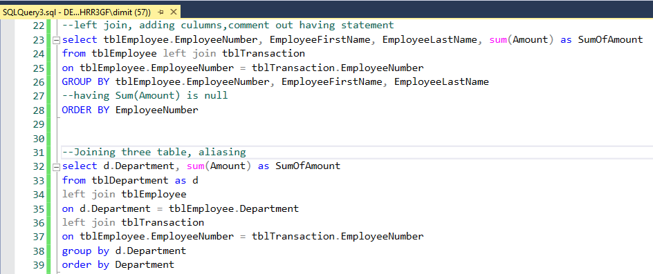

# Querying-Microsoft-Sql-Server 2019

## Project Overview
In this project I am using SSMS to manage and query  
Microsoft Sql Server 2019.

### Session 1
In first session I created three tables and inserted values into them. **[(see query)](https://github.com/DimKaisaris/Querying-Microsoft-Sql-Server/blob/main/queries/SQLQuery1.sql)**  
Functions and methods used:  Create, Alter, Drop, Alter column, Insert Into, Rollback tran, build in method for insert values for first table and query for second  
  
The third table was created as derived table from the first.  
Functions: select, into, from, group by , count, add constraint, primary key  
Finally I build the data model using Database Diagrams  

### Session 2
In this session i will explore our datasets using simple statements: select, limit, distinct, aliasing, where, comment out, order by  
as well as aggregation: max, min, avg, sum, count(*), count(distinct),group by,having **[(see query)](https://github.com/DimKaisaris/Querying-Microsoft-Sql-Server/blob/main/queries/SQLQuery2.sql)** 

### Session 3
In session 3 I created a 4th table and made a union. Then I joined two and three tables together. **[(see query)](https://github.com/DimKaisaris/Querying-Microsoft-Sql-Server/blob/main/queries/SQLQuery3.sql)**  
statements: union, left join, on, aliasing table, having and more

## Updating soon!

